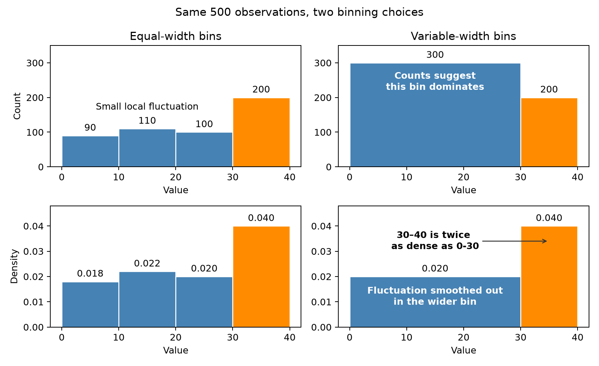

Counts can mislead with variable-width bins
===========================================

Both columns show the same 500 observations with two different binning schemes.
With equal-width bins, counts and density have the same shape. With variable-width
bins, raw counts favor wider intervals and can distort the visual comparison.

With equal-width bins, taller bars indicate a greater probability of falling
within that interval. When bin widths vary, height alone is not enough:
probability is represented by the bar's area, calculated as density multiplied
by bin width.

For a detailed introduction to density and variable-width bins, see the
`Khiops histogram tutorial <https://khiops.org/learn/histograms/>`_.